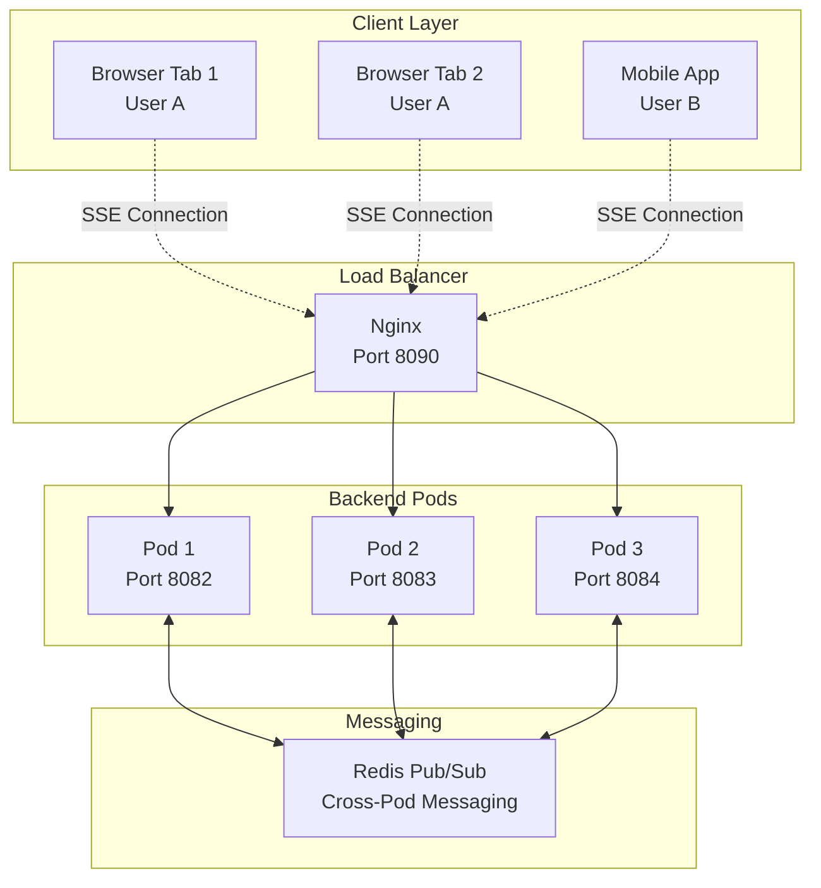
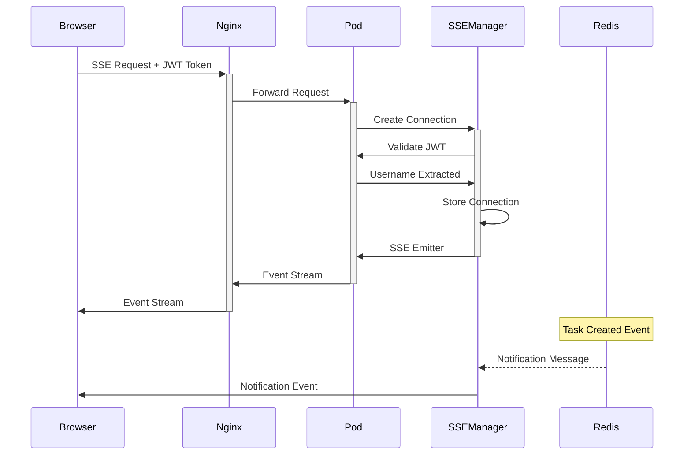
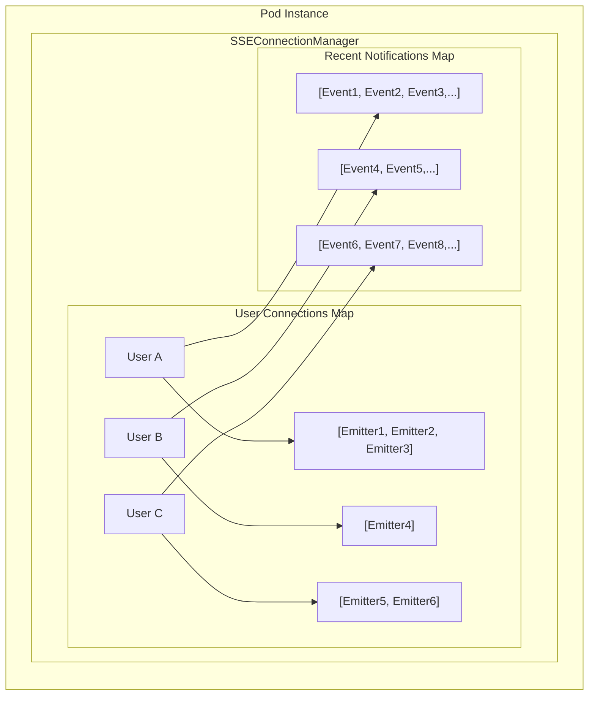
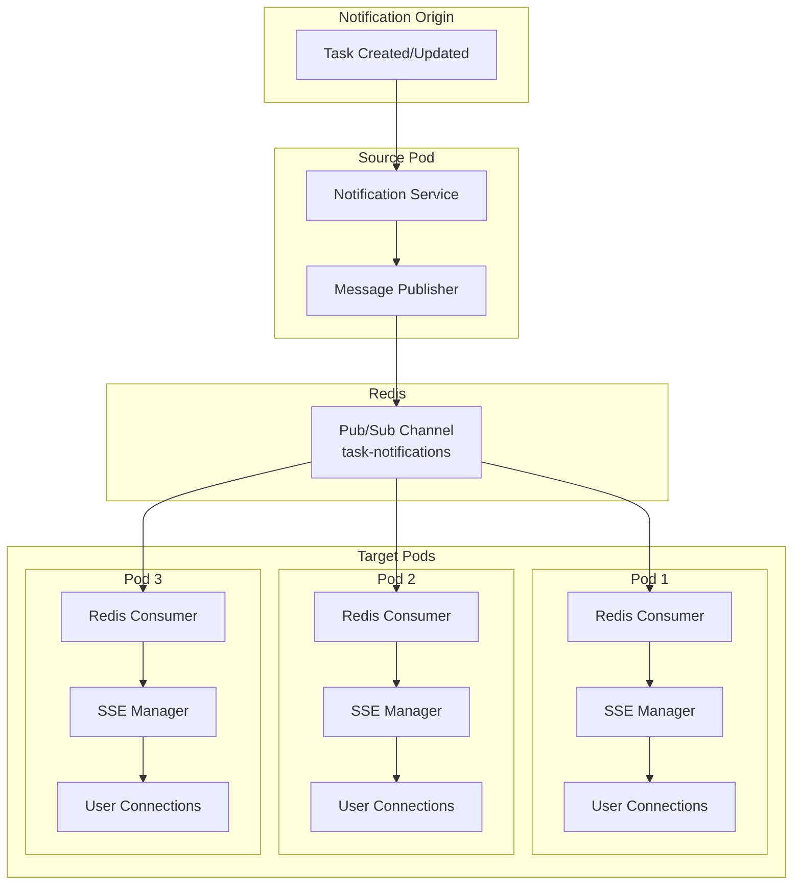
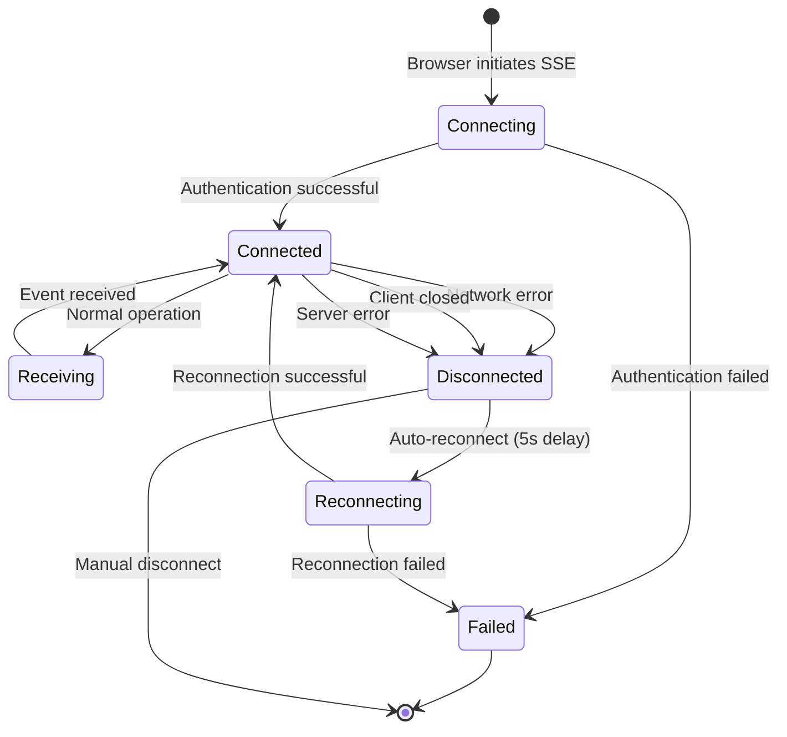
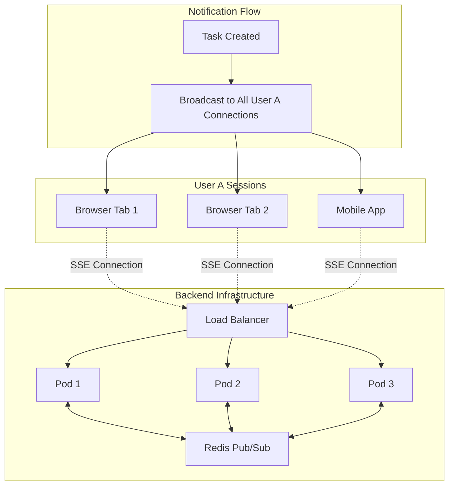
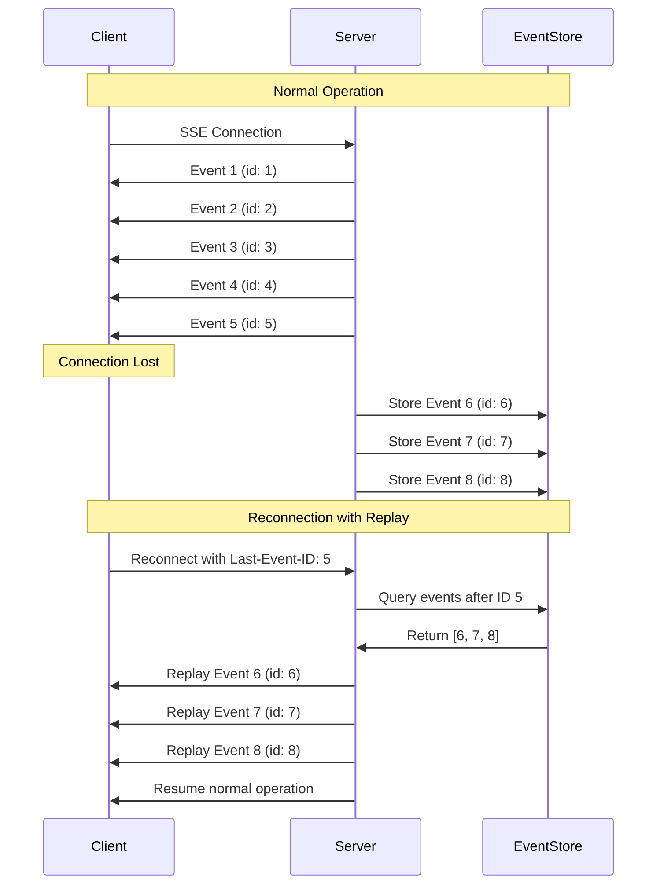
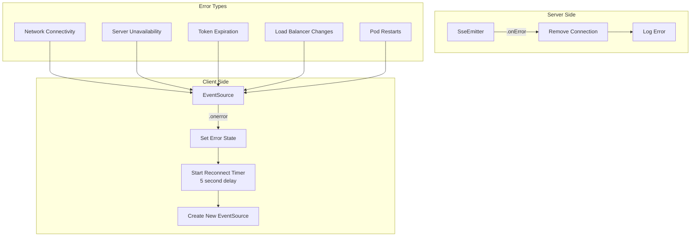

# SSE Real-Time Architecture Documentation

## Overview

This document provides a comprehensive view of the Server-Sent Events (SSE) architecture in the Todo application, showcasing how real-time notifications are delivered across multiple browser tabs, devices, and backend pods while maintaining user-specific message segregation.

## Key Capabilities

- **Multi-Tab Support**: Users can have multiple browser tabs open and receive notifications on all tabs simultaneously
- **Cross-Pod Communication**: Backend pods communicate via Redis Pub/Sub to ensure notifications reach all user connections
- **User Segregation**: Each user only receives notifications relevant to them
- **Connection Resilience**: Automatic reconnection with event replay using Last-Event-ID
- **Load Balancer Compatible**: Works seamlessly behind Nginx load balancer with sticky sessions
- **Thread-Safe**: Concurrent connection management without blocking operations

---

## Mermaid Architecture Diagrams

### 1. High-Level System Architecture



### 2. SSE Connection Flow



### 3. User Connection Segregation



### 4. Cross-Pod Notification Flow



### 5. Connection Lifecycle



### 6. Multi-Tab User Experience



### 7. Last-Event-ID Replay Mechanism



### 8. Thread Safety Architecture

```mermaid
graph TB
    subgraph "Thread Safety Model"
        subgraph "ConcurrentHashMap"
            K1[Key: User A] --> V1[CopyOnWriteArrayList<br/>[Emitter1, Emitter2, Emitter3]]
            K2[Key: User B] --> V2[CopyOnWriteArrayList<br/>[Emitter4]]
            K3[Key: User C] --> V3[CopyOnWriteArrayList<br/>[Emitter5, Emitter6]]
        end
        
        subgraph "Concurrent Operations"
            T1[Thread 1<br/>Read/Write]
            T2[Thread 2<br/>Read/Write]
            T3[Thread 3<br/>Read/Write]
        end
        
        subgraph "Benefits"
            B1[High Concurrency]
            B2[No Blocking]
            B3[Consistent Reads]
            B4[Atomic Updates]
        end
    end
    
    T1 --> K1
    T1 --> K2
    T2 --> K2
    T2 --> K3
    T3 --> K1
    T3 --> K3
    
    K1 --> B1
    K2 --> B2
    K3 --> B3
    V1 --> B4
```

### 9. Memory Management Strategy

```mermaid
graph TB
    subgraph "Memory Management"
        subgraph "Recent Notifications Cache"
            UA[User A Cache<br/>MAX_SIZE: 100]
            UB[User B Cache<br/>MAX_SIZE: 100]
            UC[User C Cache<br/>MAX_SIZE: 100]
        end
        
        subgraph "Cache Behavior"
            FIFO[FIFO Eviction<br/>When cache full]
            NewEvent[New Event Arrives]
            OldEvent[Oldest Event Removed]
        end
        
        subgraph "Connection Cleanup"
            Active[Active Emitters<br/>Keep in Collection]
            Failed[Failed Emitters<br/>Remove from Collection]
            Closed[Closed Emitters<br/>Remove from Collection]
        end
        
        subgraph "Cleanup Triggers"
            OnComplete[onCompletion()]
            OnTimeout[onTimeout()]
            OnError[onError()]
            Periodic[Periodic Cleanup]
        end
    end
    
    NewEvent --> FIFO
    FIFO --> OldEvent
    
    Active --> OnComplete
    Failed --> OnTimeout
    Closed --> OnError
    
    OnComplete --> Periodic
    OnTimeout --> Periodic
    OnError --> Periodic
```

### 10. Error Handling Flow



---

## Architecture Components

### Frontend (React)
- **useSimpleSSE Hook**: Manages SSE connections with automatic reconnection
- **EventSource API**: Browser-native SSE support with Last-Event-ID headers
- **Connection Status UI**: Visual indicators for connection state

### Backend (Spring Boot)
- **SSEConnectionManager**: Thread-safe connection management using ConcurrentHashMap
- **SseEmitter**: Spring's SSE implementation for maintaining persistent connections
- **NotificationService**: Business logic for determining which users receive notifications
- **Redis Messaging**: Cross-pod communication via Pub/Sub channels

### Infrastructure
- **Nginx Load Balancer**: Routes requests with sticky session support for SSE
- **Redis**: Provides cross-pod messaging and optional event persistence
- **Multi-Pod Deployment**: Horizontal scaling with shared state via Redis

---

## Key Benefits

1. **Real-Time Experience**: Instant notifications across all user devices and tabs
2. **Scalable Architecture**: Multiple backend pods can serve different users simultaneously
3. **Resilient Connections**: Automatic reconnection with event replay prevents message loss
4. **User Privacy**: Each user only receives their relevant notifications
5. **Load Balancer Compatible**: Works seamlessly behind standard load balancers
6. **Thread-Safe Design**: High concurrency without performance bottlenecks
7. **Memory Efficient**: Automatic cleanup of stale connections and bounded event storage

---

## Usage Instructions

### Viewing Mermaid Diagrams

To view the Mermaid diagrams:

1. **GitHub/GitLab**: Mermaid diagrams render automatically in markdown files
2. **VS Code**: Install "Mermaid Preview" extension
3. **Online**: Copy diagram code to https://mermaid.live/
4. **Documentation sites**: Most support Mermaid rendering (GitBook, Notion, etc.)

### Converting to Images

```bash
# Install mermaid CLI
npm install -g @mermaid-js/mermaid-cli

# Convert diagrams to images
mmdc -i sse-complete-architecture.md -o sse-architecture.png -t dark
```

This architecture provides a robust foundation for real-time web applications requiring immediate user notifications across multiple connections and devices.
